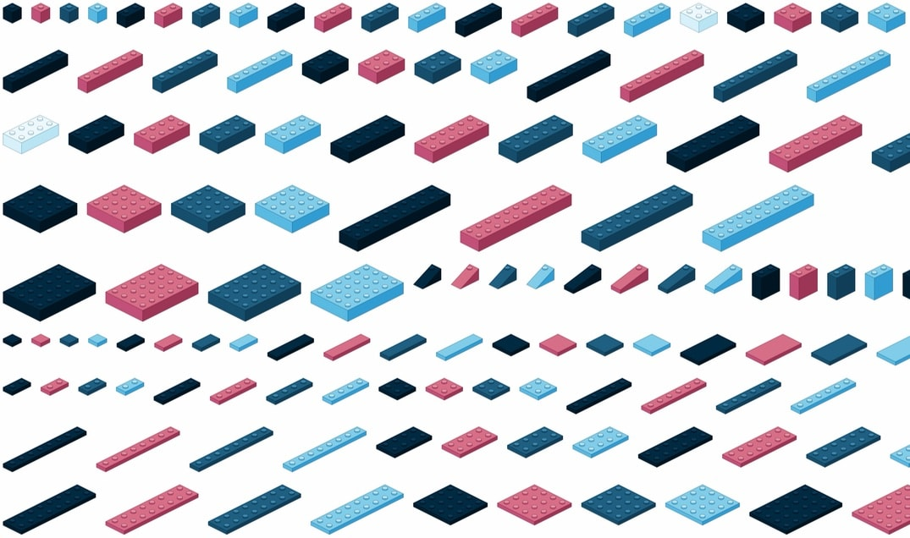

# Building Blocks

Parametric studded-brick library that generates SVG & PNG images, and a PPTX slide deck that arranges every piece at correct relative scale.



- [Layout](#layout)
- [Naming](#naming)
- [Shape catalogue](#shape-catalogue)
- [Palette sets](#palette-sets)
  - [mantel](#mantel)
  - [classic](#classic)
  - [anthropic](#anthropic)
- [Running](#running)
- [Flags](#flags)
- [PPTX output](#pptx-output)
- [PNG rendering](#png-rendering)
- [Geometry](#geometry)
- [Adding shapes](#adding-shapes)
- [Adding colours](#adding-colours)
- [Notes](#notes)
- [License](#license)

## Layout

```
svg/
  mantel/
    iso/    30 degree isometric (right-facing + mirrored)
    top/    top-down orthographic
    side/   front elevation (deduped by W+H+studs)
  classic/
    iso/
    top/
    side/
  anthropic/
    iso/
    top/
    side/

png/
  mantel/       (mirrors the SVG tree, rendered at 4x scale)
  classic/
  anthropic/

Building Blocks.pptx   (generated deck, one slide family per row)
```

Each run of `blocks.py` wipes the palette-set subdirectories it's about to regenerate so defunct files don't accumulate. Palette sets that aren't being regenerated are left alone.

Non-square iso blocks ship in both right-facing and mirrored (left-facing) variants for laying pieces out in a scene. Square blocks (e.g. 2x2) are rotationally symmetric so only one facing is emitted. Brick body heights follow real-world studded-brick proportions (9.6mm body / 8mm stud pitch = 1.2 ratio).

## Naming

`{shape}-{WxD}-{colour}-{perspective}.{svg|png}`

- shape: `brick`, `plate`, `tile`, `tall`, `slope`
- WxD: stud dimensions (e.g. `2x4`)
- colour: mantel (`ocean`, `flamingo`, `sky`, `deep-ocean`, `cloud`), classic (`l-red`, `l-blue`, `l-yellow`, `l-green`, `l-white`, `l-black`), or anthropic (`slate`, `smoke`, `ivory`, `book-cloth`, `kraft`, `manilla`)
- perspective: `iso`, `iso-mirror`, `top`, `side`

Examples:

- `brick-2x4-ocean-iso.svg` — 2x4 brick in ocean, right-facing iso
- `brick-2x4-ocean-iso-mirror.svg` — same block, left-facing
- `tile-2x2-deep-ocean-top.png` — smooth-top 2x2 tile in deep-ocean, top-down
- `slope-1x3-flamingo-iso.svg` — slope brick in flamingo

## Shape catalogue

| Shape | Heights                  | Notes                          |
| ----- | ------------------------ | ------------------------------ |
| brick | standard (3 plate-units) | studded top, the workhorse     |
| plate | thin (1 plate-unit)      | thinner profile, still studded |
| tile  | thin, smooth top         | no studs, finishing surface    |
| tall  | double-height brick      | standout vertical pieces       |
| slope | brick height with ramp   | one studded edge, sloped face  |

Sizes shipped:

- bricks: 1x1, 1x2, 1x3, 1x4, 1x6, 1x8, 2x2, 2x3, 2x4, 2x6, 2x8, 2x10, 4x4, 4x6
- plates: 1x1, 1x2, 1x4, 1x6, 1x8, 2x2, 2x4, 2x6, 2x8, 4x4, 4x6
- baseplates: 4x8, 4x10, 6x6, 8x8, 8x16, 16x16, 16x32
- tiles: 1x1, 1x2, 1x4, 2x2, 2x4
- tall: 1x2, 2x2
- slopes: 1x2, 1x3

`side/` ships only the smallest-D representative for each `(shape, W, H)` tuple. For example, the side elevation of a 2x2, 2x4, 2x6, 2x8 or 2x10 brick is identical, so only `brick-2x2-{colour}-side.svg` is emitted.

## Palette sets

Three sets ship, selectable via `--palettes` (default: `mantel`).

### mantel

| Name       | Hex     |
| ---------- | ------- |
| ocean      | #1E5E82 |
| flamingo   | #D86E89 |
| sky        | #81CCEA |
| deep-ocean | #002A41 |
| cloud      | #EEF9FD |

### classic

| Name   | Hex     |
| ------ | ------- |
| red    | #C91A09 |
| blue   | #0055BF |
| yellow | #F2CD37 |
| green  | #237841 |
| white  | #F4F4F4 |
| black  | #1B2A34 |

### anthropic

| Name       | Hex     | Notes                         |
| ---------- | ------- | ----------------------------- |
| slate      | #262625 | dark grey/near-black          |
| smoke      | #91918D | medium grey                   |
| ivory      | #F0F0EB | light off-white (accent only) |
| book-cloth | #CC785C | signature burnt orange        |
| kraft      | #D4A27F | tan                           |
| manilla    | #EBDBBC | cream                         |

Ivory is marked accent: it only renders on `brick-2x2` and `brick-2x4` because light-on-light ramps are unreadable across the full catalogue.

Each block uses a 6-colour shade ramp: top face, left wall, right wall, stud top, stud side, outline. The mantel ramps are hand-tuned; classic and anthropic are derived from the base hex via HSL darken/lighten (`auto_ramp()` in `blocks.py`).

## Running

```sh
uv run blocks.py
```

`blocks.py` declares its dependencies inline (PEP 723), so `uv run` creates an ephemeral venv with `cairosvg` and `python-pptx` and runs the script.

Plain Python works too if you've got the deps installed:

```sh
pip install cairosvg python-pptx
python3 blocks.py
```

Both paths produce the full SVG tree, rasterise matching PNGs in parallel, and write `Building Blocks.pptx` at the repo root. If `cairosvg` is missing the PNG step is skipped; if `python-pptx` is missing the deck is skipped. SVG generation has no external dependencies.

## Flags

| Flag               | Default                  | Purpose                                            |
| ------------------ | ------------------------ | -------------------------------------------------- |
| `--palettes`       | `mantel`                 | Comma-separated palette sets, or `all`             |
| `--out`            | `./svg`                  | SVG output root                                    |
| `--png-out`        | `./png`                  | PNG output root                                    |
| `--no-png`         |                          | Skip PNG rasterisation                             |
| `--no-mirror`      |                          | Skip the left-facing iso variant                   |
| `--scale`          | `4`                      | PNG pixels per SVG unit                            |
| `--min-width`      | `200`                    | Floor for tiny pieces (pixels)                     |
| `--workers`        | `cpu_count - 1`          | Parallel PNG workers                               |
| `--uniform-canvas` |                          | Pad every PNG in a view to the same dimensions     |
| `--no-pptx`        |                          | Skip PPTX generation                               |
| `--pptx-out`       | `./Building Blocks.pptx` | PPTX output path                                   |
| `--pptx-palettes`  | same as `--palettes`     | Palette sets to include in the deck                |
| `--pptx-density`   | `0.25`                   | Points per SVG unit on the slide (higher = bigger) |

## PPTX output

The generator places every PNG on a slide at an absolute pt-width computed from its SVG `viewBox`, so relative scale is preserved by construction — drag-and-drop auto-fit never enters the picture.

Each palette set writes to its own file. With one palette enabled the output is the bare `Building Blocks.pptx`; with more than one the palette name is inserted before the suffix — e.g. `Building Blocks - mantel.pptx`, `Building Blocks - anthropic.pptx`.

Layout rules:

- **One family per row.** A family is `(view, is_mirror, category, W, D)` — all 4-5 colour variants of e.g. `brick-2x4-iso` line up on a single row so you can compare colours at a glance.
- **Smaller families can share a row.** When a family's total width fits in the row's leftover space, it's appended rather than wrapping. Size changes and colour pattern restarts mark family boundaries.
- **Families stay atomic.** A family never splits across slides; if it doesn't fit below the current cursor, it moves to a fresh slide.
- **Slides quarantine by group.** Iso right-facing, iso left-facing, and baseplates each claim their own slides so bricks facing different directions don't mix.
- **Sort order.** Baseplates (plates with `W*D >= 32`) sort to the tail of the deck so giants don't orphan small pieces on shared slides.

Tune `--pptx-density` if the default feels too cramped or too sparse. At 0.25, a default mantel-only run produces ~10 slides for 475 images.

## PNG rendering

- Background: transparent (RGBA, corners are `(0, 0, 0, 0)`).
- Scale: 4 pixels per SVG unit by default. A 2x4 brick comes out ~752x486; a 1x1 is floored to 200px wide.
- `--uniform-canvas` pads every image in a view to the same pixel dimensions, so slide tools that auto-fit images still preserve relative scale across pieces. Trade-off: small pieces get a lot of transparent padding. The PPTX path avoids this entirely by setting absolute slide dimensions.

## Geometry

Constants at the top of `blocks.py` control the iso projection:

| Constant     | Default | Meaning                                                |
| ------------ | ------: | ------------------------------------------------------ |
| `U`          |      30 | screen pixels per stud along an iso axis               |
| `S`          |      15 | iso vertical step per stud (`U // 2`, 2:1 iso)         |
| `PLATE_H`    |      12 | screen height per plate-unit (brick = 3 units)         |
| `STUD_RX`    |       9 | stud ellipse radius x (~0.6 of cell, real-world ratio) |
| `STUD_RY`    |     4.5 | iso-foreshortened y radius                             |
| `STUD_RAISE` |       4 | screen offset between stud base and cap                |
| `STROKE_W`   |     0.6 | line weight on every primitive                         |

Each iso block is anchored so the rear-top corner sits at SVG origin `(0, 0)`. `iso_viewbox()` computes a snug viewBox with a 4-unit pad. All shapes are inline `<polygon>`, `<ellipse>`, `<rect>`, and `<path>` primitives — no `<defs>`, no `<symbol>`, no transforms. That keeps the output trivial to recolour or hand-edit downstream.

## Adding shapes

Block specs live in five lists at the bottom of `blocks.py`: `STANDARD_BRICKS`, `PLATES`, `TILES`, `TALL`, `SLOPES`. Each entry is a `BlockSpec(slug, W, D, H_units, show_studs, slope)`.

To add a 3x3 brick, append one line:

```python
BlockSpec("brick-3x3", 3, 3, 3),
```

Re-run and the new variant appears in every colour and (where applicable) every perspective.

## Adding colours

Colour ramps live in the `MANTEL_PALETTES`, `CLASSIC_PALETTES`, and `ANTHROPIC_PALETTES` dicts. A `Palette` is six hex strings (top face, left wall, right wall, stud top, stud side, outline) plus an optional `accent` flag. For a new hand-tuned colour:

```python
"yoda": Palette(
    name="yoda",
    top="#07883D",
    left="#066B30",
    right="#054F24",
    stud_top="#1FA85A",
    stud_side="#066B30",
    outline="#022510",
),
```

For a single-base-hex generic colour, use `auto_ramp()`:

```python
"l-orange": auto_ramp("l-orange", "#FE8A18"),
```

Pass `accent=True` to `auto_ramp()` (or set the field on a hand-tuned `Palette`) to mark a colour as accent — it'll then only render on `brick-2x2` and `brick-2x4`, where the low contrast still reads.

## Notes

- Slope bricks are `W=1` only. The ramp descends along the D (long) axis with the stud at the rear end. Angles follow the real-world standard: 1x2 is 45° (slope touches the ground at the front), 1x3+ is ~33° (1 plate-height front wall remains). Widening to multi-stud W would need extra logic in the slope branch of `iso_block`.
- Accent palettes (mantel's `cloud`, anthropic's `ivory`) render only on the slugs in `ACCENT_SLUGS` (`brick-2x2`, `brick-2x4`). They're light-on-light and would be near-invisible across the full catalogue. Mark a new palette accent by passing `accent=True` to `auto_ramp()` or setting the field on a hand-tuned `Palette`.
- `top` and `side` views skip slope and tall blocks — those perspectives don't add useful information there.
- Mirrored iso variants swap the left/right wall shades so lighting stays consistent (sun from upper-left). Pair a right-facing block with a left-facing one side-by-side and the shading reads as one scene.
- `brick-top` and `plate-top` render identical PNGs for the same `(W, D, colour)` — top-down view only sees the stud grid, not the body height. Both names are emitted so you can pick the semantic label that fits.

## License

- MIT License
- Not affiliated with any brick or block making companies
